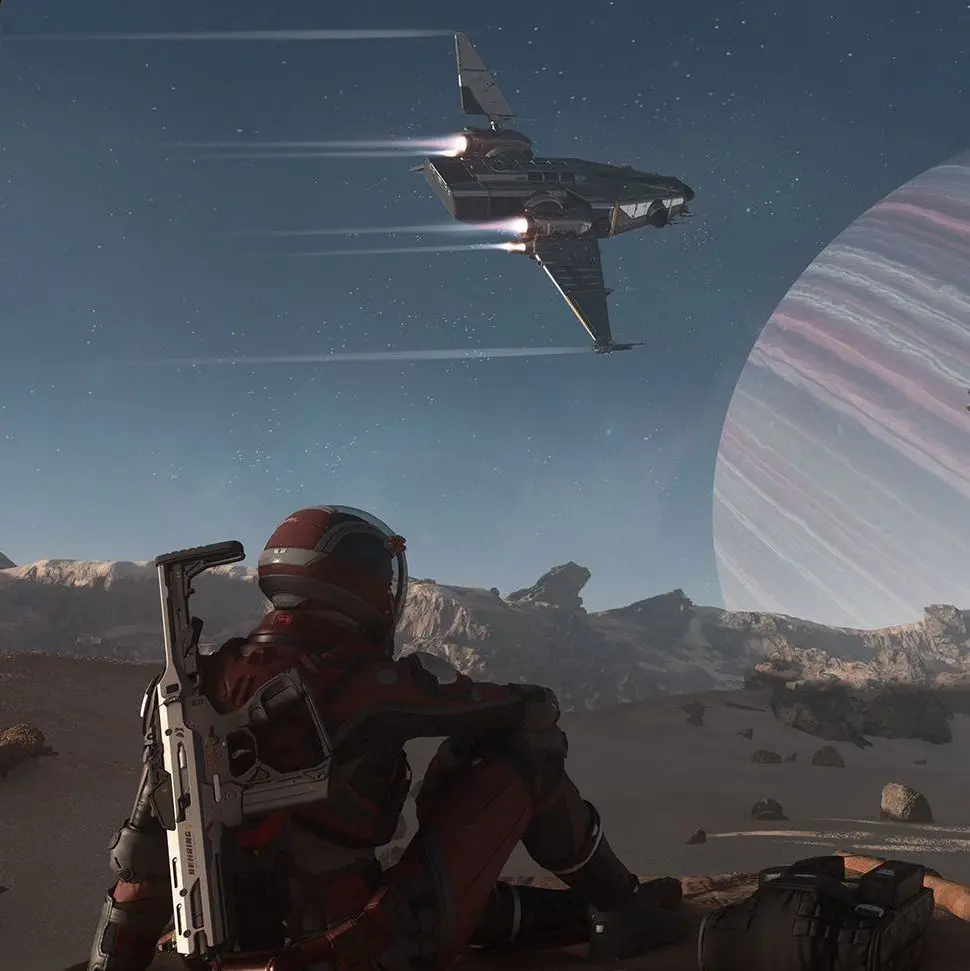

# René Lüssi

## Über mich
Schon als ich noch in die Grundschule ging, interessierte ich mich für Technik. Ich bin leidenschaftlicher Gamer und entwickle gerne Spiele zuhause an meinem PC. Bisher ist jedoch nur eines fertiggestellt worden. Momentan arbeite ich jedoch mit jemand anderem an einem Spiel, das mit Unity entwickelt wird.

#
Außerdem bin ich oft schon mit anderen, nicht gamingbezogenen Projekten in Kontakt gekommen. Ich habe bereits ein wenig mit Python programmiert, insbesondere mit TkInter.

## Hobbies
* Gaming
* Piano / Musik
* Schwimmen
* Programmieren
* Game design

