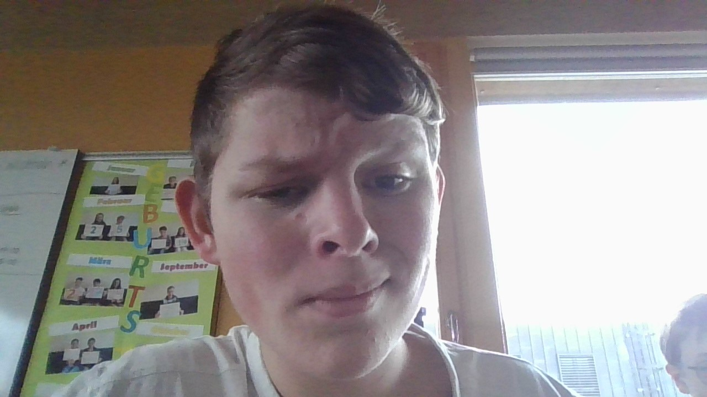

# Tom Nielsen



## Kurze Biographie

Als ehemaliger Gamer, habe ich mich schon immer für das programmieren interessiert. 
Mein Bruder ist ein Informatiker und er hat mich inspiriert auch einer zu werden.
Ich bin Norweger, aber ich wurde in der Schweiz aufgezogen und bin natürlich auch gern hier.
Ich habe eine sehr grosse Familie mit 13 Gewistern.
Ich wollte eigentlich eine Lehrstelle finden um etwas zu verdienen, aber ich war zu spät und war sehr schlecht im Bewerbungen schreiben. 
Ich ging dann zur Berufshilfe und die haben mir von der IMS erzählt. 
Ich habe die Prüfung bestanden und bin jetzt hier.
Mir macht es spass zu programmieren.
Herauszufinden wie ich einen Fehler fixen kann fordert mich heraus.

### Meine Ausbildungsschritte

- 2014 Abschluss Kindergarten
- 2020 Abschluss Primarschule
- 2024 Abschluss Seekundarschule

### Motivational quote

>Ich würde ja gerne ein paar Kilos verlieren.
Aber ich verliere nie. 
Ich bin ein Gewinner!

## Sprachen die ich spreche

- Deutsch
- Norwegisch
- Englisch
- Französisch?

## Social Media

- [Roblox](https://www.roblox.com/users/282713886/profile)

## Hallo Welt in meinen Lieblingsprachen
Diesen Code habe ich natürlich selber geschireben und nicht mit ctrl c, ctrl v von Herr Niederer kopiert 

```c
#include <stdio.h>

int main() {
    printf("God dag verden!");

    return 0;
}
```