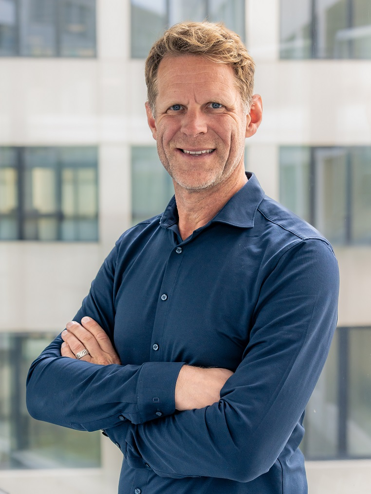

# Pascal Schönolzer

## Kurze Biographie

Mein erster Computer war ein Comodore C64. Auf diesem machte ich meine ersten Schritte in der Softwareentwicklung.
Ausflüge in de Welt des ICT-Supportes, die Ausbildung von Mitarbeitenden, wie auch die Betreuung von Lernenden runden meine Laufbahn ab.
Heute bin ich als Lehrer im Informatikbereich und Coach an der Informatikschule tätig. Nebenbei gebe ich Kurs für künftige Berufsbildner.

### Meine Ausbildungsschritte

- 2022 Berufsbildungsfachmann FA
- 2013 Erwachsenenbilder 
- 1999 Informatiker

### Meine Motivation

>Fit für die Haute-Route zu sein. :-)

## Sprachen die ich spreche

- Deutsch
- Englisch

## Social Media Profile

- [Linked In](www.linkedin.com/in/pascal-schönholzer-29b3b5b0)

